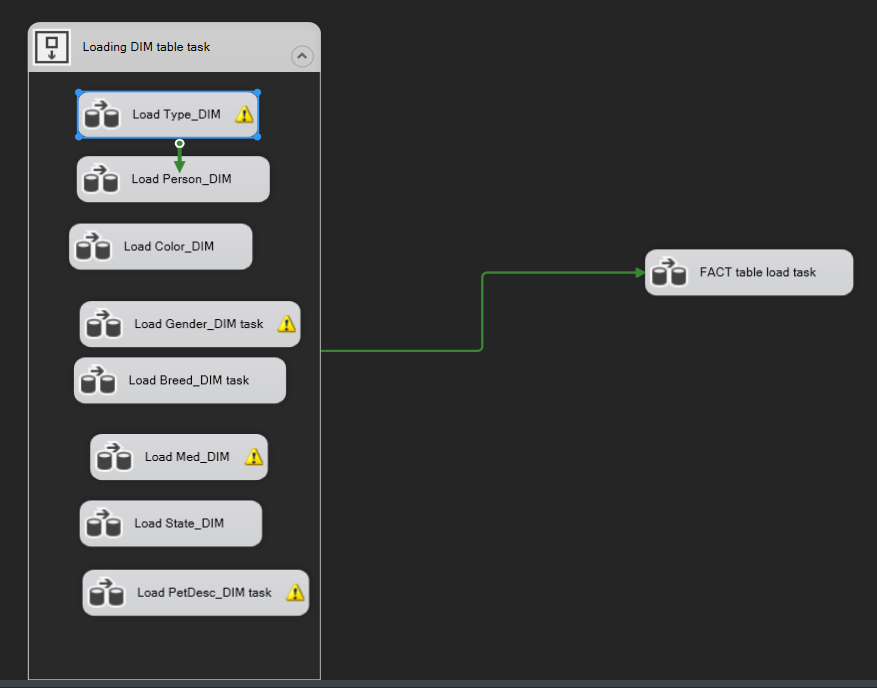
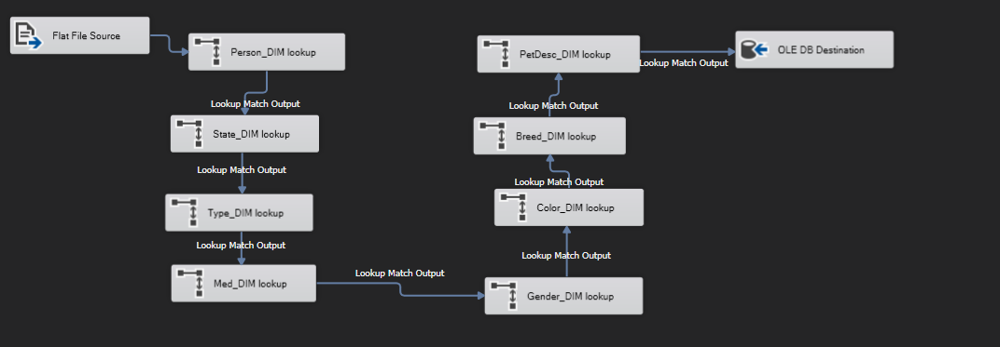

# Data Warehouse design and ETL with SSIS

## Step by step process:
1. Create a SSIS project
2. Create data warehouse ERD and turn it into a physical dw in MySQL Server
3. ETL data from [dataset](https://drive.google.com/file/d/1_RFWaLL_X8ylbKYRGlbD5Z_gdsEirov4/view?usp=sharing) to load to data warehouse
4. Test validity of data warehouse by query data from data warehouse using T-SQL

### Data Warehouse ERD design
ERD design was conducted based on the given [dataset](https://drive.google.com/file/d/1_RFWaLL_X8ylbKYRGlbD5Z_gdsEirov4/view?usp=sharing).
All dimension tables were first created, then the fact table was designed based on these dimension tables.
The principle of creating dimension table is that all categorical variables that have several options, for example
Gender variable that can be Male, Female, and Mixed will be split into separate dimension tables. The rest
numerical variables such as Fee and Quantity will be loaded into fact table.
There are 7 dimension tables in total, with 1 fact table following centralized data warehouse practice as
follows.
- Type_DIM: contains the pet type and their maturity size
- State_DIM: contains state name
- Person_DIM: contains ID of rescuers
- Breed_DIM: contains information of pet breed
- Color_DIM: contains information of pet color
- Med_DIM: contains information of medical condition
- Gender_DIM: contains information of pet gender
- PetDesc_DIM: contains information of pet in general (name, description...)
- Pet_FACT: contains every bit of information of pet, with references to other DIM tables.
Pet_FACT:
- Surrogate key: PetID (primary key)
Other DIM tables:
- Surrogate key: as noted with (PK) in the following figure  

### SQL queries to build data warehouse
The SQL script of defining these tables is saved in file [SQLscript_define_tables.sql](https://github.com/emmanguyen102/Data-Engineer-portfolio/blob/main/Data%20Warehouse%20and%20ETL/SQLscript_define_tables.sql)

### ETL process
The SSIS package file can be found [here](https://github.com/emmanguyen102/Data-Engineer-portfolio/blob/main/Data%20Warehouse%20and%20ETL/ETL_SSIS_package.dtsx).
The process of designing ETL is as follows:
1. Load data into each dim table using Sort (not to take duplicate) and Lookup (insert if no same data
in table).  
  
2. Put all load DIM table task in sequence container so that loading data simultaneously to all dim
tables (parallel ETL).
3. After loading data into DIM tables, start loading to fact table based on these DIM tables by looking
up the same match and take the id of these DIM tables so that they can match with foreign keys in
fact table.  
  
  

### Test validity of data warehouse
By answering these business questions
1. How many dogs get vaccinated?
2. How many dogs that are healthy?
3. How many dogs are female and has 3 colors?
SQL queries are saved in [this](https://github.com/emmanguyen102/Data-Engineer-portfolio/blob/main/Data%20Warehouse%20and%20ETL/SQLscript_BusinessQueries.sql) file.

## Prerequisites
1. SQL Server 2019 
2. LucidChart
3. Visual Studio 2019
4. SQL Server Integration Service extension in Visual Studio 2019

# More information
More about this project can be found on my Medium [blogpost](https://hangmortimer.medium.com/data-warehouse-part-3-etl-or-elt-a-bit-of-practice-as-well-8a7b206867fd) about ETL or ELT.
