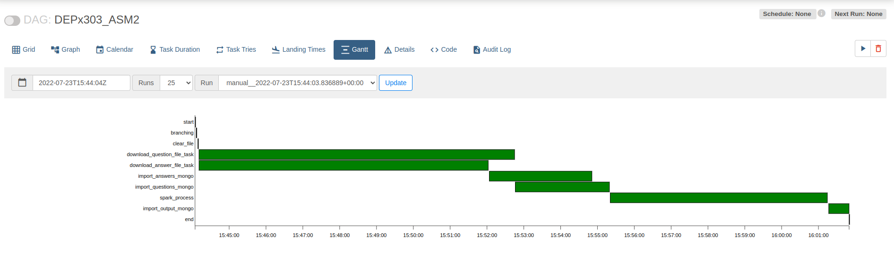
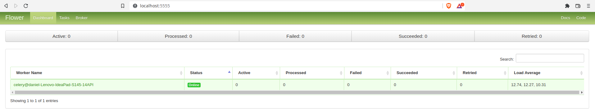

# Workflow management with Airflow

## Overview
Create a whole data pipeline from start till end, from downloading files from cloud to import data into MongoDB, get processed by PySpark and write result to csv file and save data back to MongoDB.

## Prerequisites:
Operating system: Linux  
Airflow, mongoDB, Spark, MySQL Server, RabbitMQ installed

## Step by step procedure:
1. Config airflow.cfg
2. Create DAG file 
3. Check gant chart for DAG task run result
4. (CeleryExecutor) Check flower on port 5555

### Config airflow.cfg

#### LocalExecutor
```
executor = LocalExecutor
sql_alchemy_conn = postgresql+psycopg2://<username>:<password>@localhost:5432/airflow_db
result_backend = db+postgresql://<username>:<password>@postgres/airflow
```
#### CeleryExecutor
```
executor = CeleryExecutor
sql_alchemy_conn = mysql+pymysql://<username>:<password>@localhost/airflow_db
broker_url = amqp://<username>:<password>@localhost/
result_backend = db+mysql+pymysql://<username>:<password>@localhost/airflow_db
```

### DAG file
There are 10 tasks in total including: start, branching, clear_file, download_question_file_task, download_answer_file_task, import_answers_mongo, import_questions_mongo, spark_process, import_output_mongo, end. 
- start: DummyOperator. Start of whole task.
- branching: BranchPythonOperator. If files have not yet been downloaded then move on to clear_file task, else to task end.
- clear_file: BashOperator. Clear all files in folder.
- download_question_file_task & download_answer_file_task in parallel: BashOperator. Download files from google drive.
- import_answers_mongo & import_questions_mongo in parallel: BashOperator. Import data from these 2 files to 2 different collections under the same database.
- spark_process: PythonOperator. Get data from these 2 collections to dataframe and join these 2 dataframes to answer the question: how many answers of each question? Then save results to a csv file.
- import_output_mongo: BashOperator. import data from csv file to mongo database.
- end: DummyOperator. End of the whole task. 

### The gant chart of task as follows:   


### (Optional)
Config executor to CeleryExecutor. 
Flower looks like this:  


